3-tier-application
------------------
* Over view
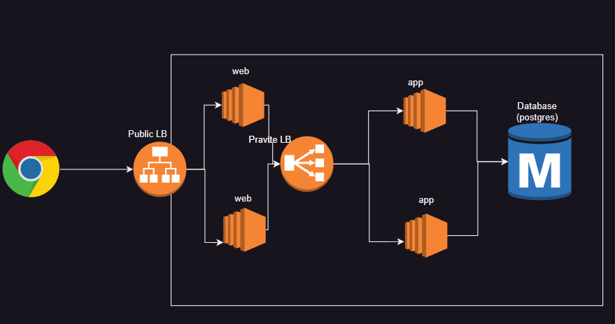
* This application works only in AWS Only as of now.
* To achive this we are using AWS Cloud Services. 
* In this application we are using postgress database.
* Database created in mumbai region (ap-south-1), because developer code written as per the reqiurement.
* [Refer here ](`https://LearningThoughtsEdu@dev.azure.com/LearningThoughtsEdu/Batch-1/_git/three-tier-example`) for the code
## Database Creation 

* Create a Postgress Database in mumbai region and give the necessary details
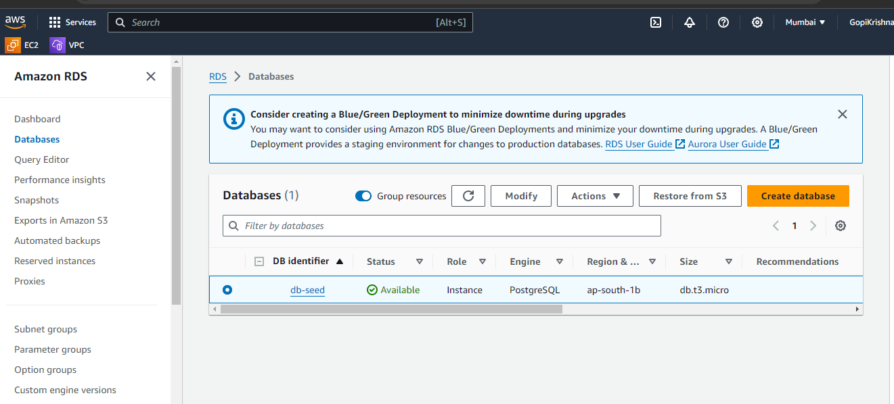

```
username= postgres
passwd= motherindia123
```
* Create a Parameter groups and give the necessary details.
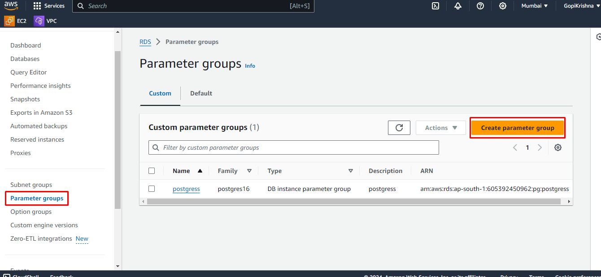

* Parameter group is created and click on edit
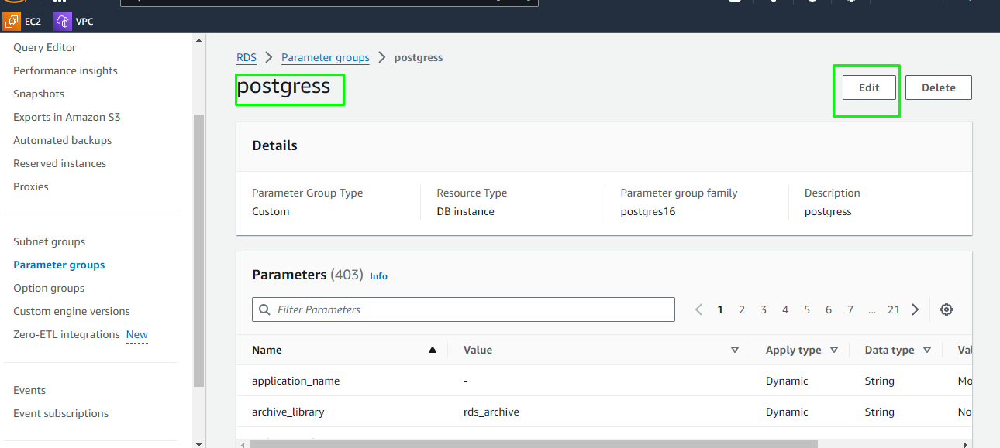

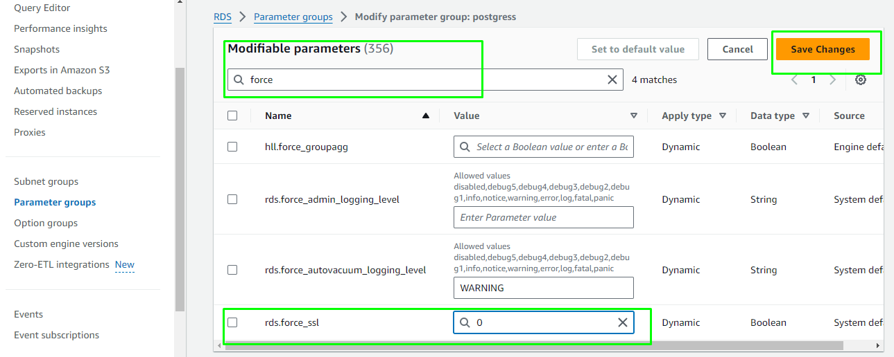

* Edit the `rds.force_ssl to 0`  now save the changes 
* Now modify the database and choose the parameter group you created.
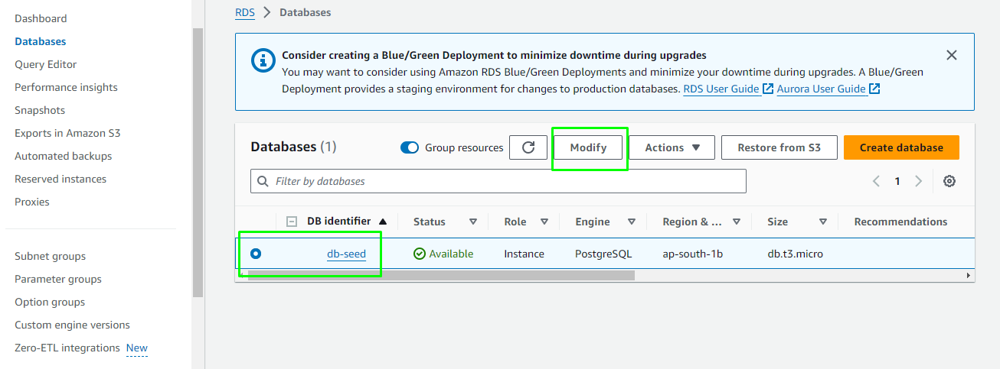

* scroll down the page in addition configaration database options select the previously created.
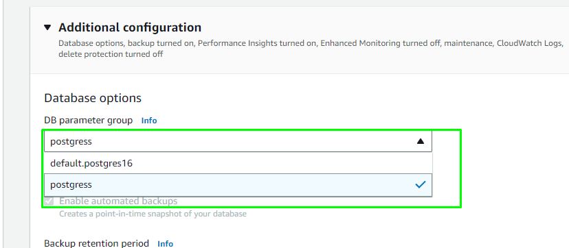

* Copy the database endpoint, username and passwd and edit on app.py file 
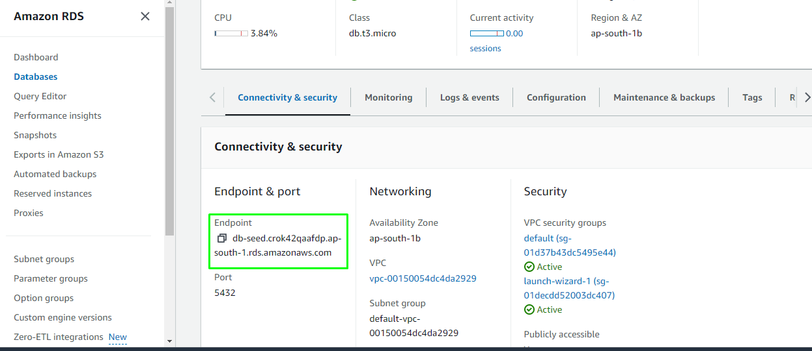
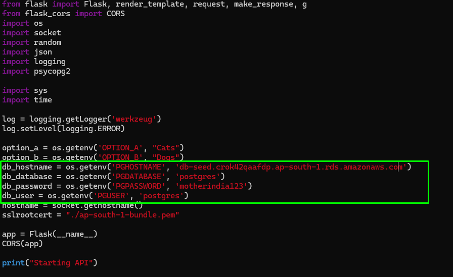


## application Environment setup and run the application

* Create an EC2 Instance and log in to machine
* Excute the following commands to install python and necessary dependencies

```bash
sudo apt update
sudo apt install python3-venv -y
python3 -m venv .venv
source .venv/bin/activate
# install dependencies
sudo apt-get update
sudo apt-get install -y build-essential libpq-dev python3-dev
pip install psycopg2
pip install -r requirements.txt
export PGHOSTNAME=db-seed.crok42qaafdp.ap-south-1.rds.amazonaws.com
export PGDATABASE=postgres
export PGPASSWORD=motherindia123
export PGUSER=postgres

```
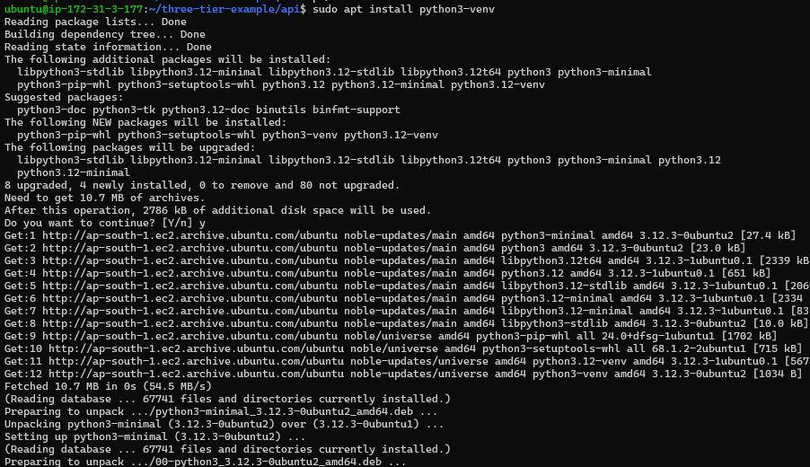
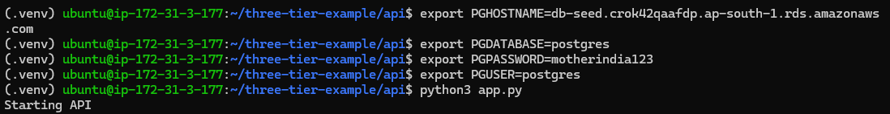
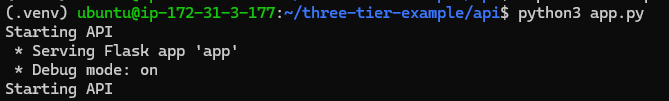


## Web tier setup

* Excute the node js commands 

```bash
#download and run the NVM installation script using curl. Execute the following command in your terminal
curl -o- https://raw.githubusercontent.com/nvm-sh/nvm/v0.39.1/install.sh | bash
source ~/.bashrc
nvm install 10 
npm install

```
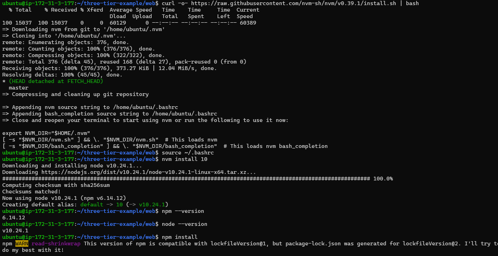
* setup is coompleted 
* Now run the api application  use this command `python3 app.py`
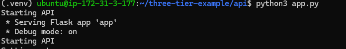
* Run the web application  use this command `npm run serve`
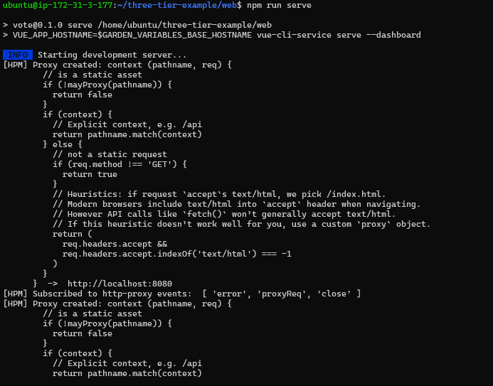

* Now Access the application by instance public ip `http://public-ip:8081`
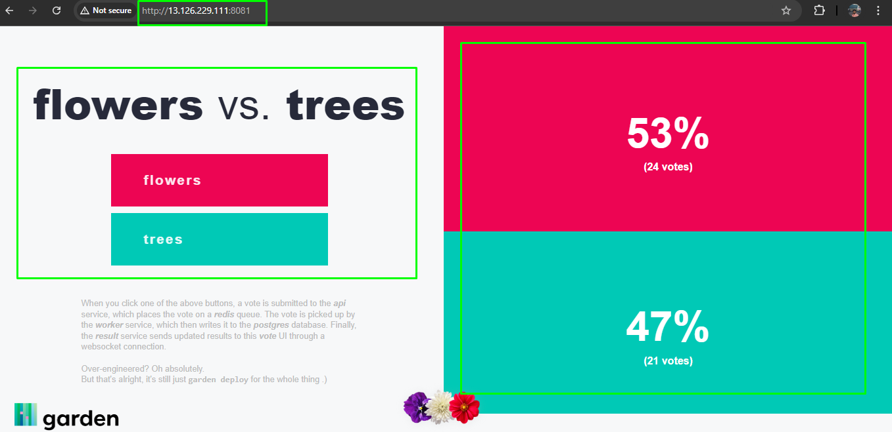
* click on voting your application and see the result.

