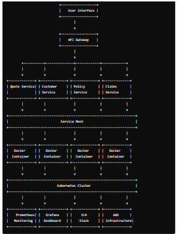

# Project:  Insurance Platform
-----------------------------
## Project Name: Insurance Platform

# Description:
Geico's insurance platform offers a comprehensive range of insurance products including auto, home, renters, and more. The platform is designed to provide users with an easy-to-use interface for obtaining quotes, purchasing policies, managing accounts, and filing claims.

### Role as a DevOps Engineer
In my role as a DevOps engineer for the Insurance Platform project, I was responsible for designing and managing the infrastructure, ensuring high availability and scalability of the platform, and implementing robust CI/CD pipelines for continuous improvement and deployment. My contributions included:

### 1. Microservices Architecture
* Designed and implemented a microservices architecture consisting of various services such as Quote Service, Policy Service, User Management Service, and Claims Service. Each service was independently deployable and scalable, which improved overall system resilience and flexibility.
### 2. CI/CD Pipeline
* Established a robust CI/CD pipeline using Jenkins. This automated the build, test, and deployment processes, allowing for faster and more reliable releases. Each microservice had its own pipeline, enabling independent updates without affecting the entire system.
### 3. Containerization and Orchestration
* Utilized Docker for containerization, ensuring that each microservice ran in its own isolated environment. Implemented Kubernetes for orchestration, which facilitated automated deployment, scaling, and management of containerized applications.
### 4. Monitoring and Logging
* Integrated monitoring tools such as Prometheus and Grafana to track system performance and health. This allowed for proactive identification of issues and minimized downtime. Implemented centralized logging with ELK Stack (Elasticsearch, Logstash, Kibana) for better visibility into application behavior.
### 5. Cloud Infrastructure Management
* Deployed the application on AWS, utilizing services like EC2 for compute, RDS (for MySQL) for database management, and S3 for file storage. Managed infrastructure as code using Terraform, which enabled version control of the infrastructure and simplified environment setups.
### 6. Security and Compliance
* Ensured that security best practices were integrated into the CI/CD pipeline. Implemented IAM roles and policies for secure access to AWS resources and conducted regular security assessments to identify vulnerabilities. Ensured compliance with industry standards and regulations.
### Key Achievements
##### Increased Deployment Frequency: 
* By implementing CI/CD practices, we reduced the deployment time from weeks to hours, significantly increasing the frequency of releases.
##### Improved System Reliability: 
* The microservices architecture allowed for better fault isolation, leading to an overall increase in system reliability and uptime.
##### Enhanced Customer Experience: 
* Through continuous monitoring and quick iterations based on user feedback, we improved the platform's responsiveness and feature set, leading to higher customer satisfaction.
# Conclusion
##### In summary, my experience with the Geico Insurance Platform project equipped me with a deep understanding of DevOps practices and tools. I successfully bridged the gap between development and operations, ensuring a seamless workflow that enhanced the overall efficiency and quality of the insurance platform. My ability to collaborate with cross-functional teams and implement automation strategies played a crucial role in the project's success.

Daily Responsibilities
-----------------------

### Monitoring System Performance

*  Regularly check dashboards in Prometheus and Grafana for system health and performance metrics.
* Monitor alerting systems for any anomalies or issues that need immediate attention.
### Managing CI/CD Pipelines
* Ensure the CI/CD pipelines (Jenkins, GitLab CI) are running smoothly.
* Troubleshoot and resolve any build or deployment failures.
* Implement and test new pipeline features or improvements.

### Handling Deployments
* Manage and execute deployments of new features, updates, or bug fixes.
* Coordinate with development teams to schedule deployments and ensure minimal disruption to services.
* Perform post-deployment checks to verify successful releases.

### Container Management

* Oversee Docker container management and ensure containers are running efficiently.
* Perform routine maintenance tasks such as image cleanup and resource optimization.

### Kubernetes Orchestration

* Manage the Kubernetes cluster for automated deployment, scaling, and management of containerized applications.
* Monitor the status of pods, nodes, and services within the cluster.
* Implement updates and changes to Kubernetes configurations as needed.

### Infrastructure Management

* Use Terraform to manage and update AWS infrastructure configurations.
* Monitor AWS services (EC2, RDS, S3) for performance and cost optimization.
* Handle scaling of resources to accommodate traffic and usage changes.

### Security and Compliance

* Regularly review and update IAM roles and policies for secure access to AWS resources.
* Conduct security assessments and vulnerability scans.
* Implement security best practices in the CI/CD pipeline and cloud infrastructure.

### Collaboration and Communication

* Attend daily stand-ups and team meetings to discuss progress, blockers, and upcoming tasks.
* Collaborate with development, QA, and product teams to align on goals and priorities.
* Provide support and guidance to other team members on DevOps best practices.

### Logging and Troubleshooting

* Monitor and analyze logs using the ELK Stack (Elasticsearch, Logstash, Kibana) to identify and troubleshoot issues.
* Respond to incidents and perform root cause analysis to prevent recurrence.

### Documentation

* Maintain comprehensive documentation for all DevOps processes, including CI/CD pipelines, infrastructure configurations, and deployment procedures.
* Document any incidents, resolutions, and changes made to the system for future reference.
### Example Daily Schedule
#### 10:00 AM - 11:00 AM

* Attend daily stand-up meeting.
* Review and update the status of ongoing tasks.
#### 11:00 AM - 12:00 PM

* Monitor system performance dashboards.
* Address any alerts or anomalies detected.
#### 12:00 PM - 01:00 PM

* Work on CI/CD pipeline improvements.
* Resolve any build or deployment issues.

#### 1:00 PM - 2:00 PM

* Coordinate with development teams for upcoming deployments.
* Review and merge pull requests related to infrastructure changes.
#### 3:00 PM - 4:00 PM

* Perform container management tasks and optimize resource usage.
* Monitor Kubernetes cluster and make necessary adjustments.
#### 4:00 PM - 5:00 PM

* Conduct security assessments and update IAM roles/policies.
* Implement security best practices in the CI/CD pipeline.
#### 5:00 PM - 6:00 PM

* Document changes made to the system and update relevant documentation.
* Prepare for the next day’s tasks and deployments.
#### 6:00 PM - 7:00 PM

* Respond to any last-minute issues or requests.
* Wrap up the day’s work and ensure all systems are stable.

##### By adhering to this schedule, a DevOps engineer can ensure that the Geico Insurance Platform remains robust, secure, and efficient, ultimately providing a better experience for users and supporting the company's business goals.

# Roles and Responsibilities as a DevOps Engineer on the Geico Insurance Platform Project
## Infrastructure Management
  ### Provisioning and Configuration: 
* Set up and manage cloud infrastructure using AWS services (e.g., EC2, RDS, S3) and tools like Terraform for infrastructure as code.
### Scalability: 
* Ensure the infrastructure can scale up or down based on traffic and resource requirements.
### Cost Management: 
* Monitor and optimize cloud costs by adjusting resource allocation and utilizing cost-effective solutions.
## Continuous Integration and Continuous Deployment (CI/CD)
### Pipeline Management: 
* Design, implement, and maintain CI/CD pipelines using tools like Jenkins and GitLab CI to automate the build, test, and deployment processes.
### Automation: 
* Develop scripts and automation tools to streamline deployment workflows and reduce manual intervention.
### Quality Assurance: 
* Ensure that automated tests are integrated into the CI/CD pipeline to catch issues early and improve software quality.
## Containerization and Orchestration
### Container Management: 
* Utilize Docker to containerize applications and ensure consistency across development, testing, and production environments.
### Kubernetes Orchestration: 
* Manage Kubernetes clusters for the deployment, scaling, and management of containerized applications.
### Resource Optimization: 
* Optimize container resource usage and performance.
## Monitoring and Logging
### System Monitoring: 
* Implement and manage monitoring solutions like Prometheus and Grafana to track system performance, availability, and health.
### Incident Response: 
* Set up alerting systems to proactively identify and respond to issues before they impact users.
### Centralized Logging: 
* Use ELK Stack (Elasticsearch, Logstash, Kibana) for centralized logging to facilitate troubleshooting and analysis.
## Security and Compliance
### Access Management: 
* Implement and manage IAM roles and policies to ensure secure access to AWS resources and services.
### Vulnerability Management: 
* Conduct regular security assessments, vulnerability scans, and audits to identify and mitigate security risks.
### Compliance: 
* Ensure adherence to industry standards and regulations (e.g., GDPR, HIPAA) through security best practices and compliance checks.
## Collaboration and Communication
### Team Collaboration: 
* Work closely with development, QA, and product teams to understand requirements, address issues, and ensure alignment with project goals.
### Documentation: 
* Maintain detailed documentation of DevOps processes, configurations, and procedures to ensure transparency and knowledge sharing.
### Stakeholder Updates: 
* Provide regular updates to stakeholders on project status, challenges, and progress.
## Incident Management and Troubleshooting
### Issue Resolution: 
* Troubleshoot and resolve infrastructure, deployment, and performance issues promptly to minimize downtime and service disruptions.
### Root Cause Analysis: 
* Conduct root cause analysis for incidents and implement preventive measures to avoid recurrence.
## Continuous Improvement
### Process Optimization: 
* Continuously evaluate and improve DevOps processes and practices to enhance efficiency and effectiveness.
### Tool Evaluation: 
* Stay updated with industry trends and evaluate new tools and technologies that can improve the DevOps workflow.

### Summary
##### As a DevOps engineer on the Geico Insurance Platform project, your role involves managing infrastructure, automating deployment processes, handling containerization and orchestration, ensuring system security and compliance, collaborating with cross-functional teams, and continuously improving processes and practices. Your responsibilities are crucial for maintaining the platform’s reliability, performance, and security while supporting rapid and efficient software development and deployment.

#### Basic self Introduction 
##### Hello, my name is Gopi Krishna. I am a DevOps Engineer with 4.6 years of experience in managing and optimizing cloud-based infrastructure and deploying scalable applications. Currently, I am working on the Geico Insurance Platform project, where I focus on implementing and managing microservices architecture, CI/CD pipelines, and container orchestration.

##### In my role, I design and maintain robust CI/CD pipelines using tools like Jenkins and GitLab CI, and I oversee the containerization of applications using Docker, with orchestration managed through Kubernetes. I am responsible for ensuring system reliability and performance by integrating monitoring tools like Prometheus and Grafana, and centralized logging with the ELK Stack.

##### I also manage cloud infrastructure on AWS, utilizing services such as EC2, RDS, and S3, and handle infrastructure as code with Terraform. Security and compliance are paramount in my work, so I implement IAM roles and policies, conduct security assessments, and ensure adherence to industry standards.

##### Throughout my career, I have demonstrated a commitment to continuous improvement, both in optimizing DevOps processes and staying abreast of the latest industry trends. My role involves close collaboration with cross-functional teams to align on goals and deliver high-quality solutions.

##### I am passionate about leveraging my skills to enhance system efficiency and drive successful outcomes for projects I am involved in.