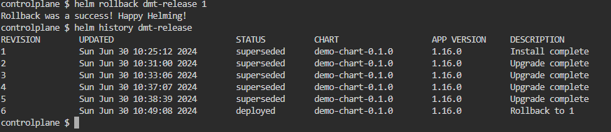
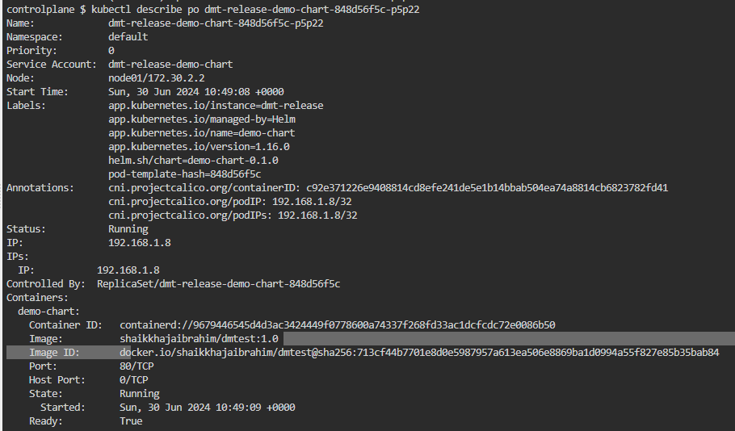

# helm version

```bash
    cd .\k8s\helm-charts\
    helm create demo-test
    tree /f
    helm template --output-dir D:\tmp\test\ .\demo-test\
    
    helm package demo-chart/
    ls
    helm install dmt-release demo-chart-0.1.0.tgz
   helm upgrade dmt-release demo-chart-0.1.0.tgz --set image.tag="3.0"
   kubectl rollout status deployment dmt-release-demo-chart 
   kubectl rollout history deployment dmt-release-demo-chart 
   helm upgrade dmt-release demo-chart-0.1.0.tgz --set image.tag="2.0"
```
* Apply the changes according to above commands

  
  