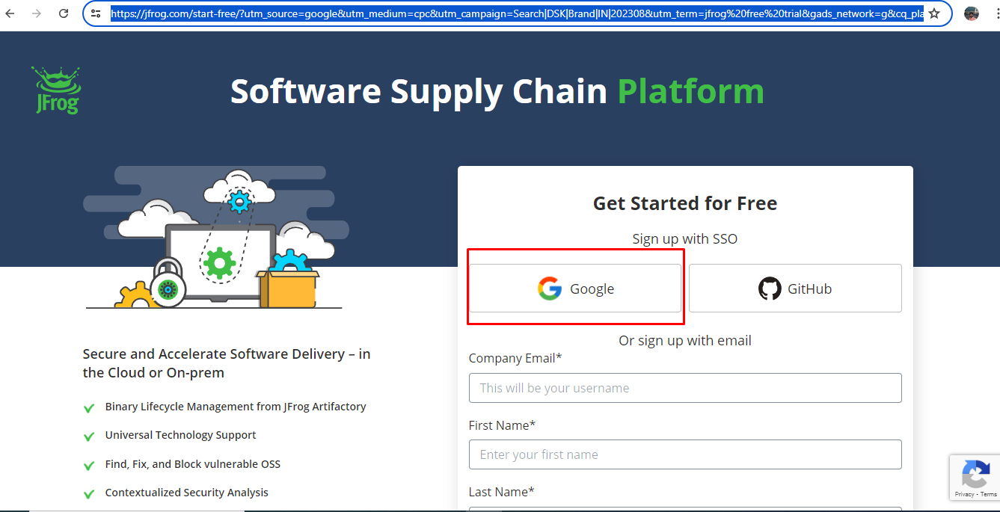
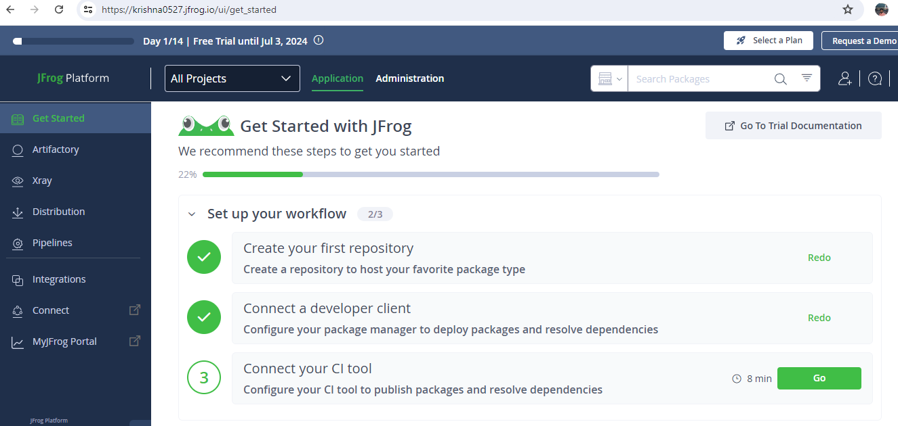
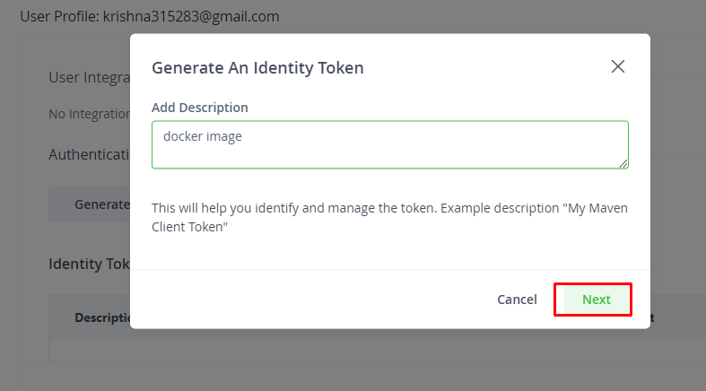
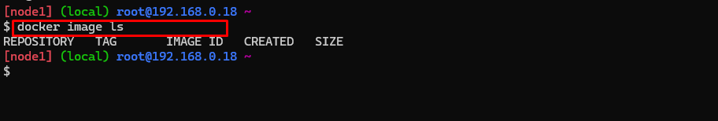
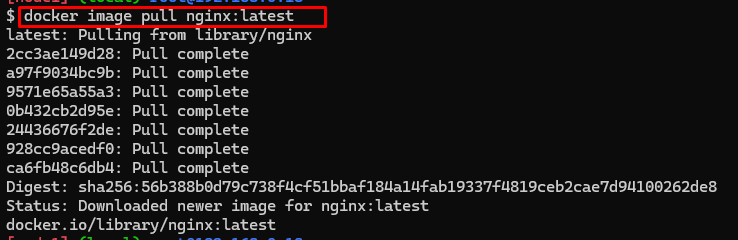
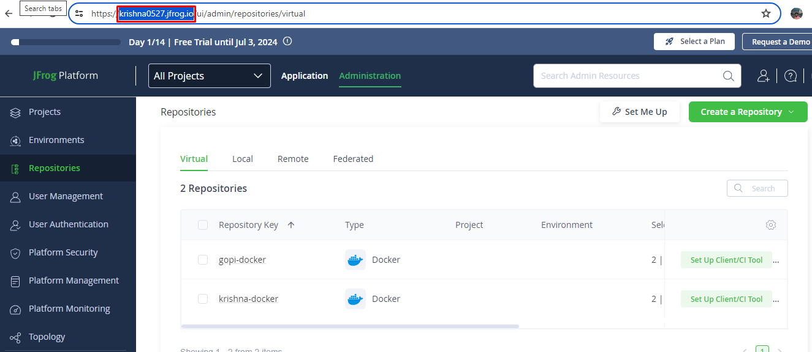
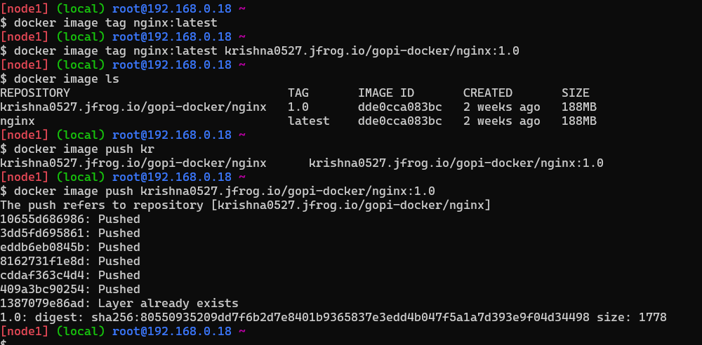
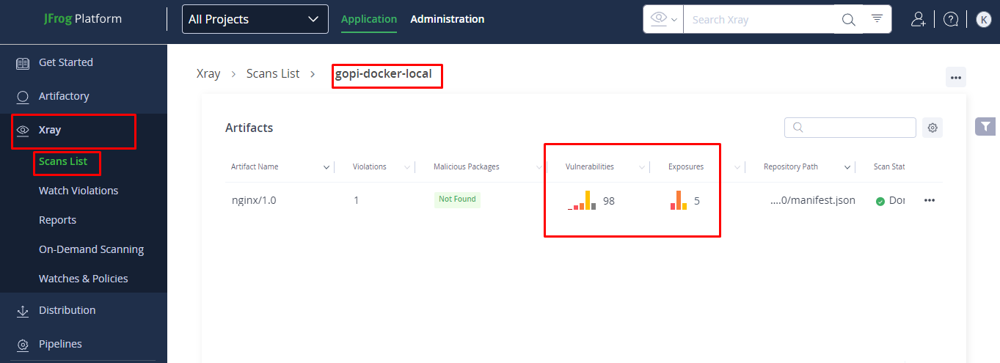

### Create a Jfrog repository account to store the praivate Docker images

https://jfrog.com/artifactory/?utm_source=google&utm_medium=cpc&utm_campaign=Search|DSK|Brand|IN|202308&utm_term=jfrog%20free%20trial&gads_network=g&cq_plac=&cq_plt=gp&utm_content=u-bin&gads_campaign_id=20437321111&gads_adgroup_id=157827667091&gads_extension_id=23305458432&gads_target_id=kwd-1598615738072&gads_matchtype=b&gad_source=1&gclid=CjwKCAjwg8qzBhAoEiwAWagLrICHLwKcramNRAQIa5CVel6vzizSjPGaupvwjmwcp4u4uuePgs-ndxoCtrcQAvD_BwE


* Give the nesseary values
* After the page like this
 
 
 
 
 * Now the page hows like this after click on continue
 
 * Now click on usermenu and Edit profile
 
 
* Now Generate an identity Token 

* Its shows onetime only now Copy the Necessary details 

* Connect the docker machine and seach for docker images

* Pull the docker images from docker hub or create your own docker images 



* Login to the docker machine using the command 
```bash
docker login <account name>
docker login krishna0527.jfrog.io
```
username: krishna315283@gmail.com
password: paste the reference token 

* Tag the docker image using the command 
```bash
docker image tag <imagename> <Reponame>
# in my case 
docker image tag nginx:latest krishna0527.jfrog.io/gopi-docker/nginx:1.0
```
* Push the docker image to Repository
```bash
# docker push < image name >
docker push krishna0527.jfrog.io/gopi-docker/nginx:1.0
```

* Check the Jfrog Repository 

* Click on the scanned 




